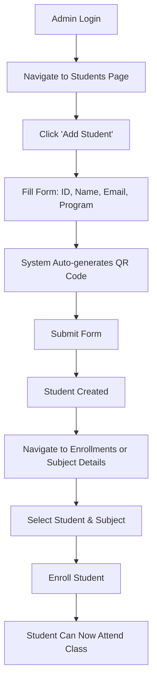
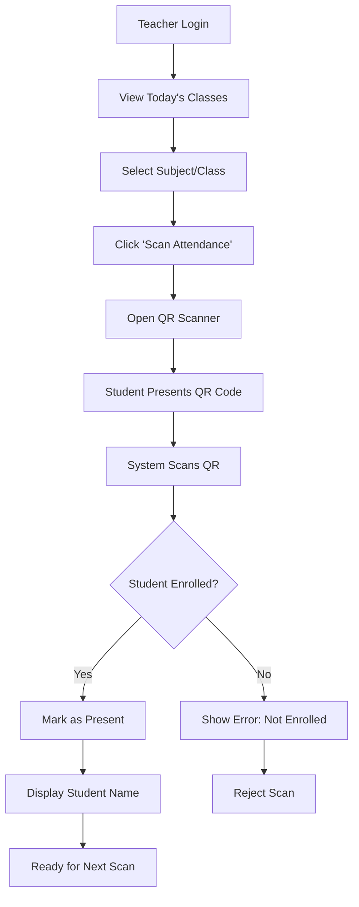
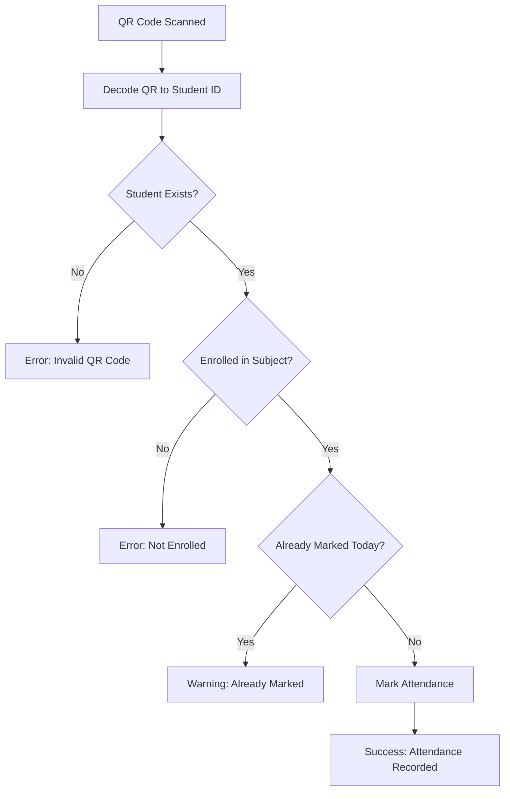

This is a [Next.js](https://nextjs.org) project bootstrapped with [`create-next-app`](https://nextjs.org/docs/app/api-reference/cli/create-next-app).

## Getting Started

First, run the development server:

```bash
npm run dev
# or
yarn dev
# or
pnpm dev
# or
bun dev
```

Open [http://localhost:3000](http://localhost:3000) with your browser to see the result.

You can start editing the page by modifying `app/page.tsx`. The page auto-updates as you edit the file.

This project uses [`next/font`](https://nextjs.org/docs/app/building-your-application/optimizing/fonts) to automatically optimize and load [Geist](https://vercel.com/font), a new font family for Vercel.

## Deploy on Vercel

The easiest way to deploy your Next.js app is to use the [Vercel Platform](https://vercel.com/new?utm_medium=default-template&filter=next.js&utm_source=create-next-app&utm_campaign=create-next-app-readme) from the creators of Next.js.

Check out our [Next.js deployment documentation](https://nextjs.org/docs/app/building-your-application/deploying) for more details.


# 📘 QR Attendance System - Complete Project Outline

---

## 🎯 Project Overview

### Project Name
**QR-Based Attendance Management System**

### Description
A web-based attendance tracking system designed for educational institutions. The system uses QR code technology for quick and accurate student attendance verification. Admin manages the entire system infrastructure, while teachers handle day-to-day attendance marking through QR code scanning.

### Technology Stack
- **Frontend:** Next.js 14+ (App Router), TypeScript, TailwindCSS
- **Backend/Database:** Firebase (Firestore, Authentication)
- **QR Code:** QR code generation and scanning libraries
- **Deployment:** Vercel (recommended) or Firebase Hosting

### Target Users
- **Educational Institutions:** Universities, colleges, training centers
- **Class Sizes:** Small to medium (scalable)
- **Use Case:** Replacing manual attendance or paper-based systems

---

## 👥 User Roles & Permissions

### 1. **Administrator (Admin)**
**Access Level:** Full system control

**Responsibilities:**
- System configuration and setup
- User management (create/edit/delete teachers)
- Student management (create/edit/delete students, generate QR codes)
- Program management (create academic programs)
- Subject management (create subjects, assign schedules and teachers)
- Enrollment management (enroll students in subjects)
- Data oversight and reports (view all attendance data)

**Can Access:**
- Admin dashboard
- Programs module
- Subjects module
- Users (teachers) module
- Students module
- Enrollments module
- System reports and analytics

**Cannot:**
- Directly scan QR codes (teacher function)

---

### 2. **Teacher**
**Access Level:** Limited to assigned subjects

**Responsibilities:**
- Mark attendance for assigned subjects
- Scan student QR codes during class
- View attendance records for their subjects
- Verify student enrollment before marking attendance
- Generate attendance reports for their classes

**Can Access:**
- Teacher dashboard
- QR scanner page
- Attendance records (own subjects only)
- List of enrolled students per subject
- Subject schedules

**Cannot:**
- Create/edit users, students, programs, or subjects
- Access other teachers' attendance data
- Modify system configuration
- Generate student QR codes

---

### 3. **Student** (Non-authenticated User)
**Access Level:** No system access

**Characteristics:**
- Data record in the database (not a login user)
- Has unique student ID and QR code
- Must be enrolled in subjects to attend
- Identified via QR code during attendance

**Interactions:**
- Present QR code to teacher for scanning
- QR code links to their student record

**Cannot:**
- Login to the system
- View their own attendance (in current scope)
- Modify any data

---

## 🎨 Functional Features

### A. Authentication & Authorization

#### Login/Logout
- **Login Page:**
  - Email and password authentication
  - Role-based redirect (admin → admin dashboard, teacher → teacher dashboard)
  - "Remember me" option
  - Password reset link
  - Form validation and error handling

- **Logout:**
  - Available in all authenticated pages
  - Clears session and redirects to login

#### Session Management
- Protected routes (middleware)
- Auto-redirect if not authenticated
- Session persistence
- Token refresh handling

---

### B. Admin Features

#### 1. Admin Dashboard (Home)
- **Stats Overview:**
  - Total students count
  - Total teachers count
  - Total programs count
  - Total subjects count
  - Total enrollments count

- **Recent Activity:**
  - Recently added students (last 5-10)
  - Recently created subjects
  - Recent enrollments

- **Quick Actions:**
  - Add new student (button)
  - Create subject (button)
  - Add program (button)
  - Enroll student (button)

- **Charts (Optional Phase 2):**
  - Students per program (pie chart)
  - Subjects per program (bar chart)
  - Attendance trends

#### 2. Programs Management
- **View Programs:**
  - List/table of all programs
  - Display: Program name, academic year, subject count, student count
  - Search and filter capabilities
  - Sortable columns

- **Create Program:**
  - Form fields: Program name, academic year
  - Validation (required fields)
  - Success/error notifications

- **Edit Program:**
  - Pre-filled form with existing data
  - Update confirmation
  - Audit trail (optional)

- **Delete Program:**
  - Confirmation dialog with warning
  - Show impact (X subjects, Y students affected)
  - Cascade handling or prevent deletion if in use

#### 3. Subjects Management
- **View Subjects:**
  - Table with: Course code, title, program, teacher, schedules, enrolled students count
  - Filter by program, teacher
  - Search by code or title
  - Pagination

- **Create Subject:**
  - Course code (unique)
  - Descriptive title
  - Select program (dropdown)
  - Assign teacher (dropdown - teachers only)
  - **Schedule Builder:**
    - Add multiple schedule blocks
    - Each schedule: Days (checkboxes), time start, time end
    - Add/remove schedule rows dynamically
  - Validation (no overlapping schedules)

- **Edit Subject:**
  - Update all fields including schedules
  - Reassign teacher
  - Update confirmation

- **View Subject Details:**
  - Complete subject information
  - List of enrolled students
  - Attendance statistics overview
  - Quick action: Enroll more students

- **Delete Subject:**
  - Confirmation with impact warning
  - Check for existing attendance records

#### 4. Users (Teachers) Management
- **View Teachers:**
  - Table: Name, email, assigned subjects count, status
  - Search by name or email
  - Filter by assigned subject

- **Create Teacher:**
  - First name, last name
  - Email (unique)
  - Password (generate or manual)
  - Assign subjects (multi-select)
  - Send welcome email (optional)

- **Edit Teacher:**
  - Update name, email
  - Reassign subjects
  - Reset password option
  - Activate/deactivate account

- **View Teacher Details:**
  - Full profile
  - List of assigned subjects
  - Quick stats (total students across subjects)
  - Link to attendance records

- **Delete Teacher:**
  - Confirmation dialog
  - Reassign subjects warning
  - Soft delete or hard delete option

#### 5. Students Management
- **View Students:**
  - Table: Student ID, name, program, email (optional), QR code status
  - Search by student ID or name
  - Filter by program
  - Sortable columns
  - QR code preview icon (click to view/download)

- **Create Student:**
  - Student ID (unique, auto-increment option)
  - First name, last name
  - Email (optional)
  - Select program
  - Auto-generate QR code on creation
  - QR code preview before saving

- **Edit Student:**
  - Update all fields except student ID
  - Change program (with warning if enrolled in subjects)
  - Regenerate QR code option

- **View Student Details:**
  - Full profile
  - Large QR code display
  - Download QR code (PNG/PDF)
  - Print QR code option
  - List of enrolled subjects
  - Attendance summary (optional)

- **Delete Student:**
  - Confirmation with impact analysis
  - Remove enrollments option
  - Archive instead of delete (optional)

- **Bulk Actions (Optional Phase 2):**
  - Import students from CSV
  - Generate QR codes in batch
  - Print multiple QR codes

#### 6. Enrollments Management
- **View Enrollments:**
  - Table: Student, subject, program, enrollment date
  - Filter by student, subject, or program
  - Search functionality

- **Enroll Student:**
  - Select student (dropdown or search)
  - Select subject (filtered by student's program)
  - Validation: Check if already enrolled
  - Bulk enrollment option

- **Remove Enrollment:**
  - Confirmation dialog
  - Warning if attendance records exist
  - Soft delete (keep history) option

- **Enrollment by Subject (Alternative View):**
  - Select subject first
  - Show all students in that program
  - Checkboxes to enroll multiple at once
  - Save bulk enrollment

---

### C. Teacher Features

#### 1. Teacher Dashboard
- **My Subjects:**
  - Cards or list of assigned subjects
  - Subject code, title, schedule
  - Quick link to scan attendance
  - Student count per subject

- **Today's Classes:**
  - Subjects scheduled for today
  - Time and room info (if available)
  - Quick scan button
  - Attendance status (completed/pending)

- **Recent Attendance:**
  - Last 10-20 attendance records marked
  - Student name, subject, date, status
  - Quick edit option (mark as late, etc.)

- **Quick Stats:**
  - Total students across all subjects
  - Attendance rate today
  - Pending classes for the day

#### 2. QR Code Scanner
- **Scan Interface:**
  - Camera view for QR scanning
  - Manual input option (type student ID)
  - Select subject/class session first
  - Verify schedule (is this the right time?)

- **Scan Workflow:**
  1. Teacher selects subject and date/time
  2. Opens camera scanner
  3. Student presents QR code
  4. System decodes QR → finds student
  5. Validates enrollment in the subject
  6. Marks attendance as "Present"
  7. Shows success message with student name
  8. Ready for next scan

- **Validation:**
  - Check if student is enrolled in the subject
  - Check if already marked for this session
  - Duplicate scan prevention (within same session)
  - Invalid QR code handling

- **Scan Results:**
  - Show student name and photo (if available)
  - Attendance status confirmation
  - Option to mark as "Late" instead of "Present"
  - Scan history list (students scanned this session)

#### 3. Attendance Records
- **View Attendance:**
  - Filter by subject, date range
  - Table: Student, date, status, time
  - Export to CSV/Excel
  - Print option

- **Manual Attendance Entry:**
  - For students who forgot QR code
  - Search student by name or ID
  - Mark attendance manually
  - Add notes (optional)

- **Edit Attendance:**
  - Change status (Present ↔ Late ↔ Absent)
  - Add timestamp corrections
  - Admin approval required (optional)

- **Attendance Reports:**
  - Summary by subject
  - Summary by date range
  - Individual student attendance history
  - Attendance rate percentage
  - Export options

#### 4. Class Management
- **View Enrolled Students:**
  - List of students per subject
  - Student details (ID, name, program)
  - Attendance history per student
  - Mark all present/absent (bulk action)

- **Session Management (Optional):**
  - Start attendance session
  - Close session (no more scans accepted)
  - Session history

---

### D. Student Features (Future Scope - Optional)

**Note:** Students currently have no system access, but these features could be added later:

- **Student Portal (Read-Only):**
  - Login with student ID or QR code
  - View own attendance records
  - View enrolled subjects and schedules
  - Download personal QR code
  - Attendance summary and statistics

- **Notifications (Future):**
  - Email notification when attendance is marked
  - Low attendance warnings
  - Schedule changes

---

## 🗄️ Database Schema (Firestore)

### Collections Overview

```
firestore/
├── users (Admin & Teachers)
├── students (Student records)
├── programs (Academic programs)
├── subjects (Courses)
│   └── [subjectId]/attendance (Subcollection)
└── enrollments (Student-Subject mapping)
```

---

### 1. **users** Collection

```typescript
{
  id: string (document ID = Firebase Auth UID)
  first_name: string
  last_name: string
  email: string
  role: "admin" | "teacher"
  assigned_subjects: string[] // array of subject IDs (teachers only)
  created_at: Timestamp
}
```

**Indexes:**
- `email` (for login queries)
- `role` (for filtering by role)

---

### 2. **students** Collection

```typescript
{
  id: string (auto-generated document ID)
  student_id: string (unique student number, e.g., "2024-00001")
  first_name: string
  last_name: string
  email: string | null (optional)
  program_id: string (reference to programs)
  qr_code: string (encoded student_id or encrypted token)
  created_at: Timestamp
}
```

**Indexes:**
- `student_id` (unique, for lookups)
- `qr_code` (for QR scan lookups)
- `program_id` (for filtering students by program)

---

### 3. **programs** Collection

```typescript
{
  id: string (auto-generated)
  name: string (e.g., "BS Information Technology")
  academic_year: string (e.g., "2025-2026")
  created_at: Timestamp
}
```

**Indexes:**
- `name` (for search)
- `academic_year` (for filtering)

---

### 4. **subjects** Collection

```typescript
{
  id: string (auto-generated)
  course_code: string (e.g., "IT101")
  descriptive_title: string (e.g., "Introduction to Programming")
  program_id: string (reference to programs)
  teacher_id: string (reference to users)
  schedules: Array<{
    days: string[] // ["Mon", "Wed", "Fri"]
    time_start: string // "08:00"
    time_end: string // "10:00"
  }>
  created_at: Timestamp
}
```

**Indexes:**
- `course_code` (unique, for search)
- `program_id` (for filtering by program)
- `teacher_id` (for teacher's subjects)

---

### 5. **subjects/[subjectId]/attendance** Subcollection

```typescript
{
  id: string (auto-generated)
  student_id: string (reference to students)
  date: string (YYYY-MM-DD format)
  status: "Present" | "Absent" | "Late"
  schedule: {
    days: string[]
    time_start: string
    time_end: string
  }
  timestamp: Timestamp (server timestamp)
}
```

**Indexes (Composite):**
- `student_id` + `date` (descending)
- `date` + `timestamp` (descending)

---

### 6. **enrollments** Collection

```typescript
{
  id: string (auto-generated)
  student_id: string (reference to students)
  subject_id: string (reference to subjects)
  program_id: string (reference to programs)
  enrolled_at: Timestamp
}
```

**Indexes (Composite):**
- `student_id` + `enrolled_at` (descending)
- `subject_id` + `enrolled_at` (descending)
- `student_id` + `subject_id` (unique constraint)

---

## 🔐 Security Rules

```javascript
rules_version = '2';
service cloud.firestore {
  match /databases/{database}/documents {
    
    function isSignedIn() {
      return request.auth != null;
    }
    
    function getUserRole() {
      return isSignedIn() 
        ? get(/databases/$(database)/documents/users/$(request.auth.uid)).data.role 
        : null;
    }
    
    function isAdmin() {
      return isSignedIn() && getUserRole() == 'admin';
    }
    
    function isTeacher() {
      return isSignedIn() && getUserRole() == 'teacher';
    }
    
    // Users (Admin & Teachers)
    match /users/{userId} {
      allow read: if isSignedIn();
      allow create: if isAdmin();
      allow update: if isAdmin() || (isSignedIn() && request.auth.uid == userId);
      allow delete: if isAdmin();
    }
    
    // Students (no auth)
    match /students/{studentId} {
      allow read: if isSignedIn();
      allow write: if isAdmin();
    }
    
    // Programs
    match /programs/{programId} {
      allow read: if isSignedIn();
      allow write: if isAdmin();
    }
    
    // Subjects
    match /subjects/{subjectId} {
      allow read: if isSignedIn();
      allow write: if isAdmin();
      
      // Attendance subcollection
      match /attendance/{attendanceId} {
        allow read: if isSignedIn();
        allow create: if isTeacher() || isAdmin();
        allow update, delete: if isAdmin();
      }
    }
    
    // Enrollments
    match /enrollments/{enrollmentId} {
      allow read: if isSignedIn();
      allow write: if isAdmin();
    }
  }
}
```

---

## 📁 Project Structure

```
src/
├── app/                          # Next.js App Router
│   ├── (auth)/                   # Auth route group (public)
│   │   ├── login/
│   │   │   └── page.tsx         # Login page
│   │   └── layout.tsx           # Auth layout (centered form)
│   │
│   ├── (dashboard)/              # Dashboard route group (protected)
│   │   ├── layout.tsx           # Dashboard layout (sidebar + header)
│   │   │
│   │   ├── admin/               # Admin pages
│   │   │   ├── page.tsx         # Admin dashboard home
│   │   │   ├── programs/
│   │   │   │   └── page.tsx     # Programs CRUD
│   │   │   ├── subjects/
│   │   │   │   └── page.tsx     # Subjects CRUD
│   │   │   ├── users/
│   │   │   │   └── page.tsx     # Teachers CRUD
│   │   │   ├── students/
│   │   │   │   └── page.tsx     # Students CRUD
│   │   │   └── enrollments/
│   │   │       └── page.tsx     # Enrollments management
│   │   │
│   │   └── teacher/             # Teacher pages
│   │       ├── page.tsx         # Teacher dashboard
│   │       ├── scan/
│   │       │   └── page.tsx     # QR scanner
│   │       └── attendance/
│   │           └── page.tsx     # View/edit attendance
│   │
│   ├── api/                      # API routes (optional)
│   │   ├── auth/
│   │   ├── students/
│   │   └── attendance/
│   │
│   ├── globals.css
│   ├── layout.tsx               # Root layout
│   └── page.tsx                 # Landing/redirect page
│
├── components/                   # Reusable components
│   ├── ui/                      # Base UI (shadcn/ui)
│   │   ├── button.tsx
│   │   ├── card.tsx
│   │   ├── input.tsx
│   │   ├── table.tsx
│   │   ├── dialog.tsx
│   │   └── ...
│   │
│   ├── layout/
│   │   ├── Sidebar.tsx          # Dashboard sidebar
│   │   ├── Header.tsx           # Dashboard header
│   │   └── ProtectedRoute.tsx   # Auth wrapper
│   │
│   ├── forms/
│   │   ├── ProgramForm.tsx
│   │   ├── SubjectForm.tsx
│   │   ├── TeacherForm.tsx
│   │   ├── StudentForm.tsx
│   │   └── EnrollmentForm.tsx
│   │
│   ├── tables/
│   │   ├── ProgramsTable.tsx
│   │   ├── SubjectsTable.tsx
│   │   ├── TeachersTable.tsx
│   │   ├── StudentsTable.tsx
│   │   └── AttendanceTable.tsx
│   │
│   ├── attendance/
│   │   ├── QRScanner.tsx        # QR scanning component
│   │   ├── QRCodeDisplay.tsx    # Display student QR code
│   │   └── AttendanceStats.tsx
│   │
│   └── dashboard/
│       ├── StatsCard.tsx        # Dashboard stat cards
│       └── RecentActivity.tsx
│
├── lib/                          # Utilities
│   ├── firebase/
│   │   ├── config.ts            # Firebase init
│   │   ├── auth.ts              # Auth helpers
│   │   └── firestore.ts         # Firestore CRUD
│   │
│   ├── hooks/
│   │   ├── useAuth.ts           # Auth context/hook
│   │   ├── useStudents.ts       # Students data hook
│   │   ├── useSubjects.ts       # Subjects data hook
│   │   └── useAttendance.ts     # Attendance hook
│   │
│   ├── types/
│   │   ├── index.ts             # Export all types
│   │   ├── user.ts              # User types
│   │   ├── student.ts           # Student types
│   │   ├── program.ts           # Program types
│   │   ├── subject.ts           # Subject types
│   │   └── attendance.ts        # Attendance types
│   │
│   ├── utils/
│   │   ├── qr-generator.ts      # QR code generation
│   │   ├── qr-scanner.ts        # QR code scanning logic
│   │   ├── date-helpers.ts      # Date formatting utilities
│   │   ├── validation.ts        # Form validation
│   │   └── permissions.ts       # Role-based access helpers
│   │
│   └── constants.ts             # App constants
│
├── middleware.ts                 # Route protection
├── .env.local                    # Environment variables
└── next.config.js
```

---

## 🔄 User Workflows

### Admin Workflow: Adding a Student and Enrolling



### Teacher Workflow: Marking Attendance



### QR Scan Validation Flow



---

## 🎨 UI/UX Considerations

### Design Principles
- **Clean & Minimal:** Avoid clutter, focus on essential information
- **Responsive:** Mobile-first design (teachers may use tablets/phones)
- **Fast:** Quick load times, instant feedback on actions
- **Accessible:** WCAG AA compliance, keyboard navigation

### Color Scheme (Suggested)
- **Primary (Admin):** Blue (#3B82F6)
- **Secondary (Teacher):** Green (#10B981)
- **Accent (Students):** Purple (#8B5CF6)
- **Success:** Green (#22C55E)
- **Warning:** Yellow (#F59E0B)
- **Error:** Red (#EF4444)
- **Neutral:** Gray scale

### Key UI Components
- **Tables:** Sortable, paginated, with search and filters
- **Forms:** Clear labels, inline validation, error messages
- **Modals:** For quick actions (add/edit), with backdrop
- **Cards:** For dashboard stats and data display
- **Buttons:** Primary (filled), secondary (outline), danger (red)
- **Toast Notifications:** Success/error feedback (top-right)
- **Loading States:** Spinners, skeleton screens

### Mobile Considerations
- **Sidebar:** Collapses to hamburger menu
- **Tables:** Convert to cards/accordions on mobile
- **QR Scanner:** Full-screen camera view on mobile
- **Forms:** Stack vertically, larger touch targets

---

## 🚀 Development Phases

### Phase 1: Foundation (MVP)
**Timeline:** 2-3 weeks

- ✅ Firebase setup and configuration
- ✅ Authentication (login/logout)
- ✅ Admin dashboard (basic stats)
- ✅ Programs CRUD
- ✅ Subjects CRUD (without complex schedules)
- ✅ Teachers CRUD
- ✅ Students CRUD (without QR generation)
- ✅ Basic enrollments

**Goal:** Admin can manage all data, but no QR/attendance yet

---

### Phase 2: Core Functionality
**Timeline:** 2-3 weeks

- ✅ QR code generation for students
- ✅ Student QR code display/download
- ✅ Teacher dashboard
- ✅ QR scanner implementation
- ✅ Attendance marking (scan workflow)
- ✅ Attendance validation (enrollment check)
- ✅ Basic attendance records view

**Goal:** Teachers can scan QR codes and mark attendance

---

### Phase 3: Enhanced Features
**Timeline:** 2-3 weeks

- ✅ Advanced subject schedules (multiple time blocks)
- ✅ Attendance reports and exports
- ✅ Manual attendance entry (for teachers)
- ✅ Edit attendance records
- ✅ Search and filter improvements
- ✅ Better error handling and validation
- ✅ Loading states and optimistic updates

**Goal:** System is fully functional with good UX

---

### Phase 4: Polish & Optimization
**Timeline:** 1-2 weeks

- ✅ Dashboard charts and analytics
- ✅ Bulk actions (import students, bulk enroll)
- ✅ Print QR codes (batch)
- ✅ Session management (start/close attendance)
- ✅ Notifications (optional)
- ✅ Performance optimization
- ✅ Security audit
- ✅ Testing and bug fixes

**Goal:** Production-ready system

---

### Future Enhancements (Post-MVP)
- Student portal (view own attendance)
- Email notifications
- SMS notifications for low attendance
- Parent portal
- Mobile app (React Native)
- Facial recognition (alternative to QR)
- Integration with LMS (Learning Management Systems)
- Advanced analytics and predictive insights
- Multi-campus support
- Attendance-based grading
- Geolocation verification (ensure on-campus)

---

## 📊 Key Metrics & KPIs

### System Performance
- Page load time < 2 seconds
- QR scan speed < 1 second
- Attendance marking < 500ms

### User Metrics
- Time to mark attendance for 30 students: < 5 minutes
- Admin time to add student: < 2 minutes
- Teacher time to view attendance report: < 30 seconds

### Adoption Metrics
- Number of active teachers
- Number of students with QR codes
- Daily attendance records
- System uptime percentage

---

## 🔒 Security Considerations

### Authentication
- Firebase Auth handles password hashing
- Strong password requirements (8+ chars, mix of types)
- Password reset via email
- Session timeout after inactivity
- Prevent brute force attacks (rate limiting)

### Data Access
- Role-based access control (Firestore rules)
- Admin: full access
- Teachers: read own subjects, write attendance only
- Students: no direct database access

### QR Code Security
- Use encrypted tokens instead of plain student IDs (optional)
- QR codes should expire after academic year (optional)
- Rate limit QR scans (prevent spam)
- Log all scans for audit trail

### Data Privacy
- Store minimal student personal information
- Encrypt sensitive data
- GDPR/data protection compliance
- Regular backups
- Audit logs for admin actions

---

## 🧪 Testing Strategy

### Unit Tests
- Firebase helper functions
- Utility functions (date formatting, validation)
- QR generation/decoding logic

### Integration Tests
- Authentication flow
- CRUD operations
- Attendance marking workflow
- Enrollment validation

### End-to-End Tests
- Full user journeys (admin, teacher)
- QR scanning simulation
- Form submissions
- Error scenarios

### Manual Testing
- Cross-browser testing (Chrome, Firefox, Safari)
- Mobile responsiveness
- QR scanner on real devices
- Print QR codes

---

## 📖 Documentation

### User Documentation
- Admin guide (PDF/web)
- Teacher guide (PDF/web)
- FAQ section
- Video tutorials (optional)

### Developer Documentation
- API documentation
- Database schema reference
- Setup instructions (README)
- Deployment guide
- Contributing guidelines

---

## 🚢 Deployment

### Hosting
- **Recommended:** Vercel (Next.js optimized)
- **Alternative:** Firebase Hosting
- **Database:** Firebase Firestore (already configured)

### CI/CD
- GitHub Actions or Vercel auto-deploy
- Automated testing on pull requests
- Staging environment for testing
- Production deployment approval

### Environment Variables
```bash
# Production .env
NEXT_PUBLIC_FIREBASE_API_KEY=xxx
NEXT_PUBLIC_FIREBASE_AUTH_DOMAIN=xxx
NEXT_PUBLIC_FIREBASE_PROJECT_ID=xxx
NEXT_PUBLIC_FIREBASE_STORAGE_BUCKET=xxx
NEXT_PUBLIC_FIREBASE_MESSAGING_SENDER_ID=xxx
NEXT_PUBLIC_FIREBASE_APP_ID=xxx
```

### Monitoring
- Firebase Analytics
- Error tracking (Sentry or similar)
- Performance monitoring
- Usage statistics

---

## 💰 Cost Estimation (Firebase)

### Firebase Free Tier (Spark Plan)
- **Firestore:** 50K reads, 20K writes, 20K deletes per day
- **Authentication:** Unlimited
- **Hosting:** 10GB storage, 360MB/day bandwidth

**Suitable for:** Small schools (< 500 students, < 20 teachers)

### Firebase Pay-as-You-Go (Blaze Plan)
- **Firestore:** $0.06 per 100K reads, $0.18 per 100K writes
- **Authentication:** Free
- **Hosting:** $0.026/GB storage, $0.15/GB bandwidth

**Estimated cost for 1000 students, 50 teachers:**
- ~$20-50/month depending on usage

---

## ✅ Success Criteria

### Technical
- ✅ System handles 50 concurrent QR scans
- ✅ 99.9% uptime
- ✅ Zero data loss
- ✅ All user roles function correctly

### User Experience
- ✅ Teachers can mark attendance faster than paper-based system
- ✅ Admins can generate reports in under 1 minute
- ✅ Less than 3 clicks to mark attendance

### Business
- ✅ 90% of teachers use the system daily
- ✅ 95% of students have valid QR codes
- ✅ Reduction in attendance disputes
- ✅ Improved attendance tracking accuracy

---

## 📞 Support & Maintenance

### Support Channels
- Email support for admins/teachers
- In-app help documentation
- FAQ section
- Video tutorials

### Maintenance
- Regular Firebase rule audits
- Security updates
- Performance optimization
- Bug fixes and feature requests

---

## 🎯 Next Steps (Immediate)
## 🎯 Next Steps (Immediate)

1. ✅ **Firebase Setup Complete** - Authentication and Firestore configured
2. ✅ **Schema Designed** - All collections and relationships defined
3. ✅ **Security Rules Applied** - Role-based access control implemented
4. 🔄 **Create Sample Data** - Populate database with test data
5. ⏳ **Build Authentication** - Login page and auth context
6. ⏳ **Admin Dashboard** - Start with admin pages
7. ⏳ **Teacher Dashboard** - QR scanning functionality
8. ⏳ **Testing & Refinement**

---

## 📝 Current Status: Ready to Create Sample Data

### What We'll Create Next:

#### 1. Sample Programs (2-3)
```
- BS Information Technology (2025-2026)
- BS Computer Science (2025-2026)
- BS Business Administration (2025-2026)
```

#### 2. Sample Teachers (3-5)
```
- John Doe (teaches IT subjects)
- Jane Smith (teaches CS subjects)
- Bob Johnson (teaches multiple programs)
```

#### 3. Sample Students (10-15 per program)
```
- Student IDs: 2024-00001, 2024-00002, etc.
- Distributed across programs
- QR codes generated for each
```

#### 4. Sample Subjects (5-10)
```
- IT101: Intro to Programming (John Doe)
- IT102: Data Structures (Jane Smith)
- CS101: Computer Fundamentals (Bob Johnson)
- etc.
```

#### 5. Sample Enrollments
```
- Enroll students in subjects based on their programs
- 20-30 enrollments total for testing
```

#### 6. Sample Attendance Records
```
- Some attendance data for testing reports
- Mix of Present, Late, Absent statuses
```

---

## 🛠️ Tools & Libraries We'll Need

### Already Installed
- ✅ Next.js 14+
- ✅ TypeScript
- ✅ Firebase SDK
- ✅ TailwindCSS

### To Install (Before Building UI)

```bash
# UI Components (shadcn/ui)
npx shadcn-ui@latest init

# QR Code Generation
npm install qrcode
npm install @types/qrcode --save-dev

# QR Code Scanning
npm install react-qr-scanner
# or
npm install html5-qrcode

# Date/Time Utilities
npm install date-fns

# Form Handling
npm install react-hook-form
npm install @hookform/resolvers
npm install zod  # for validation

# Icons
npm install lucide-react

# CSV Export (for reports)
npm install papaparse
npm install @types/papaparse --save-dev

# PDF Generation (for QR codes)
npm install jspdf

# Data Tables
npm install @tanstack/react-table
```

---

## 🎨 UI Component Library Choice

### Option 1: shadcn/ui (Recommended)
**Pros:**
- Copy-paste components (no package bloat)
- Full TypeScript support
- Highly customizable
- Built on Radix UI (accessible)
- TailwindCSS integration

**Components we'll use:**
- Button, Input, Select, Checkbox
- Table, Dialog (Modal), Dropdown Menu
- Card, Tabs, Tooltip
- Form components

### Option 2: Chakra UI
**Pros:**
- Comprehensive component library
- Good documentation
- Built-in dark mode

**Cons:**
- Larger bundle size
- Less customization flexibility

### Option 3: Material-UI
**Pros:**
- Industry standard
- Mature ecosystem

**Cons:**
- Heavy bundle size
- Opinionated design

**Recommendation:** Use **shadcn/ui** for this project

---

## 📐 Page Layout Structure

### Authentication Pages Layout
```
┌─────────────────────────────┐
│                             │
│    [Logo/App Name]          │
│                             │
│    ┌─────────────────┐      │
│    │  Login Form     │      │
│    │  - Email        │      │
│    │  - Password     │      │
│    │  - Submit       │      │
│    └─────────────────┘      │
│                             │
│    Forgot Password?         │
│                             │
└─────────────────────────────┘
```

### Dashboard Layout
```
┌──────────┬──────────────────────────────────┐
│          │  Header (breadcrumb, user menu)  │
│          ├──────────────────────────────────┤
│          │                                  │
│ Sidebar  │     Main Content Area            │
│          │                                  │
│ - Home   │  ┌──────────────────────┐        │
│ - Progs  │  │  Page Content        │        │
│ - Subjs  │  │                      │        │
│ - Users  │  │  - Tables            │        │
│ - Studs  │  │  - Forms             │        │
│ - Enroll │  │  - Charts            │        │
│          │  └──────────────────────┘        │
│ Logout   │                                  │
└──────────┴──────────────────────────────────┘
```

### Mobile Layout (Responsive)
```
┌──────────────────────┐
│ [☰]  Title  [👤]    │  ← Header
├──────────────────────┤
│                      │
│   Content Area       │
│   (stacked)          │
│                      │
│   Cards instead      │
│   of tables          │
│                      │
└──────────────────────┘
```

---

## 🔐 Authentication Flow Detail

### Login Process
```typescript
User enters email/password
  ↓
Validate form (client-side)
  ↓
Call Firebase signInWithEmailAndPassword()
  ↓
Success?
  ├─ Yes → Fetch user data from Firestore
  │         ↓
  │       Check role
  │         ├─ Admin → Redirect to /admin
  │         └─ Teacher → Redirect to /teacher
  │
  └─ No → Show error message
           (Invalid credentials, account disabled, etc.)
```

### Session Management
```typescript
// On app load
Check if user is authenticated (onAuthStateChanged)
  ↓
If authenticated:
  ├─ Fetch user data from Firestore
  ├─ Store in context (useAuth)
  └─ Allow access to dashboard
  
If not authenticated:
  └─ Redirect to /login
```

### Protected Routes (Middleware)
```typescript
// middleware.ts
export function middleware(request: NextRequest) {
  const isAuthenticated = checkAuth(); // check cookie/token
  const { pathname } = request.nextUrl;
  
  // Public routes
  if (pathname.startsWith('/login')) {
    return isAuthenticated 
      ? redirect to dashboard based on role
      : continue;
  }
  
  // Protected routes
  if (pathname.startsWith('/admin') || pathname.startsWith('/teacher')) {
    return isAuthenticated 
      ? continue
      : redirect to /login;
  }
}
```

---

## 📊 Data Validation Rules

### Student Creation
```typescript
{
  student_id: {
    required: true,
    unique: true,
    pattern: /^\d{4}-\d{5}$/,  // 2024-00001
    message: "Format: YYYY-NNNNN"
  },
  first_name: {
    required: true,
    minLength: 2,
    maxLength: 50
  },
  last_name: {
    required: true,
    minLength: 2,
    maxLength: 50
  },
  email: {
    required: false,
    pattern: email regex
  },
  program_id: {
    required: true,
    exists: true  // must be valid program
  }
}
```

### Subject Creation
```typescript
{
  course_code: {
    required: true,
    unique: true,
    pattern: /^[A-Z]{2,4}\d{3}$/,  // IT101, CSCI101
    maxLength: 10
  },
  descriptive_title: {
    required: true,
    minLength: 5,
    maxLength: 100
  },
  program_id: {
    required: true,
    exists: true
  },
  teacher_id: {
    required: true,
    exists: true,
    role: "teacher"  // must be a teacher, not admin
  },
  schedules: {
    required: true,
    minItems: 1,
    validate: {
      noOverlap: true,  // schedules don't overlap
      validDays: true,  // days are Mon-Sun
      validTimes: true  // end > start
    }
  }
}
```

### Enrollment Validation
```typescript
{
  student_id: {
    required: true,
    exists: true  // student must exist
  },
  subject_id: {
    required: true,
    exists: true  // subject must exist
  },
  validate: {
    sameProgram: true,  // student.program_id == subject.program_id
    notAlreadyEnrolled: true,  // no duplicate enrollments
    subjectNotFull: true  // if capacity limit exists (optional)
  }
}
```

### Attendance Validation (QR Scan)
```typescript
{
  qr_code: {
    required: true,
    exists: true  // must decode to valid student
  },
  subject_id: {
    required: true,
    exists: true
  },
  validate: {
    studentEnrolled: true,  // student must be enrolled in subject
    notDuplicate: true,  // not already marked today for this subject
    withinSchedule: true,  // current time matches subject schedule (optional)
    teacherAssigned: true  // teacher is assigned to this subject
  }
}
```

---

## 🎯 QR Code Implementation Details

### QR Code Content Structure

**Option 1: Simple (Student ID)**
```typescript
qrContent = student.student_id;  // "2024-00001"
```
**Pros:** Simple, human-readable  
**Cons:** Less secure, can be forged

**Option 2: JSON Payload**
```typescript
qrContent = JSON.stringify({
  student_id: "2024-00001",
  issued: "2025-10-31",
  expires: "2026-10-31"
});
```
**Pros:** More data, expiration check  
**Cons:** Larger QR code

**Option 3: Encrypted Token (Most Secure)**
```typescript
// Generate token
const token = encrypt({
  student_id: "2024-00001",
  timestamp: Date.now()
}, SECRET_KEY);

qrContent = token;  // "eyJhbGc..."
```
**Pros:** Secure, can't be forged  
**Cons:** Requires encryption/decryption

**Recommendation:** Start with **Option 1** (simple), upgrade to **Option 3** later if needed

### QR Code Generation
```typescript
// lib/utils/qr-generator.ts
import QRCode from 'qrcode';

export async function generateQRCode(studentId: string): Promise<string> {
  try {
    // Generate as data URL (base64)
    const qrDataUrl = await QRCode.toDataURL(studentId, {
      width: 300,
      margin: 2,
      color: {
        dark: '#000000',
        light: '#FFFFFF'
      }
    });
    
    return qrDataUrl;  // "data:image/png;base64,..."
  } catch (error) {
    console.error('QR generation error:', error);
    throw error;
  }
}

// Alternative: Generate as file (for download)
export async function generateQRCodeFile(
  studentId: string,
  filename: string
): Promise<Buffer> {
  return await QRCode.toBuffer(studentId);
}
```

### QR Code Scanning
```typescript
// components/attendance/QRScanner.tsx
import { Html5Qrcode } from 'html5-qrcode';

const scanner = new Html5Qrcode("qr-reader");

scanner.start(
  { facingMode: "environment" },  // Use back camera
  {
    fps: 10,    // frames per second
    qrbox: 250  // scanning box size
  },
  (decodedText) => {
    // Success callback
    handleScanSuccess(decodedText);  // decodedText = student_id
  },
  (errorMessage) => {
    // Error callback (optional)
  }
);

async function handleScanSuccess(studentId: string) {
  // 1. Get student from Firestore
  const student = await getStudentByQRCode(studentId);
  
  if (!student) {
    showError("Invalid QR code");
    return;
  }
  
  // 2. Check enrollment
  const isEnrolled = await checkEnrollment(student.id, currentSubjectId);
  
  if (!isEnrolled) {
    showError(`${student.first_name} ${student.last_name} is not enrolled`);
    return;
  }
  
  // 3. Check if already marked
  const alreadyMarked = await checkAttendanceToday(
    student.id,
    currentSubjectId
  );
  
  if (alreadyMarked) {
    showWarning(`${student.first_name} ${student.last_name} already marked`);
    return;
  }
  
  // 4. Mark attendance
  await markAttendance({
    student_id: student.id,
    subject_id: currentSubjectId,
    date: formatDate(new Date()),
    status: "Present",
    schedule: currentSchedule
  });
  
  // 5. Show success
  showSuccess(`✓ ${student.first_name} ${student.last_name} - Present`);
  
  // 6. Play sound (optional)
  playBeep();
}
```

---

## 📱 Responsive Design Breakpoints

```typescript
// TailwindCSS default breakpoints
{
  'sm': '640px',   // Small tablets
  'md': '768px',   // Tablets
  'lg': '1024px',  // Laptops
  'xl': '1280px',  // Desktops
  '2xl': '1536px'  // Large desktops
}
```

### Responsive Patterns

**Sidebar:**
```tsx
// Desktop: Always visible
// Tablet: Collapsible
// Mobile: Hamburger menu overlay

<aside className="
  hidden lg:block        // Hidden on mobile/tablet
  w-64                   // Fixed width on desktop
  bg-gray-900
">
  {/* Sidebar content */}
</aside>

{/* Mobile menu */}
<Sheet>  {/* shadcn/ui Sheet component */}
  <SheetTrigger className="lg:hidden">☰</SheetTrigger>
  <SheetContent side="left">
    {/* Sidebar content */}
  </SheetContent>
</Sheet>
```

**Tables:**
```tsx
// Desktop: Full table
// Mobile: Card layout

<div className="hidden md:block">
  <Table>...</Table>
</div>

<div className="md:hidden space-y-4">
  {data.map(item => (
    <Card key={item.id}>
      {/* Display data as card */}
    </Card>
  ))}
</div>
```

**Forms:**
```tsx
// Stack fields on mobile, side-by-side on desktop

<div className="grid grid-cols-1 md:grid-cols-2 gap-4">
  <Input label="First Name" />
  <Input label="Last Name" />
</div>
```

---

## 🧩 Reusable Components Architecture

### Base Components (shadcn/ui)
```
components/ui/
├── button.tsx          // All button variants
├── input.tsx           // Text inputs
├── select.tsx          // Dropdowns
├── checkbox.tsx        // Checkboxes
├── radio-group.tsx     // Radio buttons
├── textarea.tsx        // Multi-line text
├── card.tsx            // Card container
├── dialog.tsx          // Modals
├── table.tsx           // Data tables
├── tabs.tsx            // Tab navigation
├── badge.tsx           // Status badges
└── toast.tsx           // Notifications
```

### Composed Components
```
components/
├── layout/
│   ├── Sidebar.tsx           // Uses: Link, Badge
│   ├── Header.tsx            // Uses: DropdownMenu, Avatar
│   └── ProtectedRoute.tsx    // Uses: useAuth hook
│
├── forms/
│   ├── ProgramForm.tsx       // Uses: Input, Button
│   ├── SubjectForm.tsx       // Uses: Input, Select, Multi-schedule
│   ├── TeacherForm.tsx       // Uses: Input, MultiSelect
│   ├── StudentForm.tsx       // Uses: Input, Select, QRPreview
│   └── EnrollmentForm.tsx    // Uses: Select (searchable)
│
├── tables/
│   ├── DataTable.tsx         // Reusable table with sorting/pagination
│   ├── ProgramsTable.tsx     // Uses: DataTable
│   ├── SubjectsTable.tsx     // Uses: DataTable
│   ├── TeachersTable.tsx     // Uses: DataTable
│   ├── StudentsTable.tsx     // Uses: DataTable, QRIcon
│   └── AttendanceTable.tsx   // Uses: DataTable, StatusBadge
│
├── attendance/
│   ├── QRScanner.tsx         // QR camera interface
│   ├── QRCodeDisplay.tsx     // Show/download QR
│   ├── ScanResult.tsx        // Show scan success/error
│   └── AttendanceStats.tsx   // Charts/graphs
│
└── dashboard/
    ├── StatsCard.tsx         // Number card with icon
    ├── RecentActivity.tsx    // List recent actions
    └── QuickActions.tsx      // Shortcut buttons
```

---

## 🔄 State Management Strategy

### Auth State (Context)
```typescript
// context/AuthContext.tsx
interface AuthContextType {
  user: FirebaseUser | null;
  userData: User | null;  // Firestore data
  loading: boolean;
  signIn: (email: string, password: string) => Promise<void>;
  signOut: () => Promise<void>;
}

// Usage in components
const { user, userData, signOut } = useAuth();
```

### Server State (React Query - Optional)
```typescript
// For caching Firestore data
import { useQuery, useMutation, useQueryClient } from '@tanstack/react-query';

// Fetch students
const { data: students, isLoading } = useQuery({
  queryKey: ['students'],
  queryFn: getAllStudents
});

// Create student mutation
const createStudentMutation = useMutation({
  mutationFn: createStudent,
  onSuccess: () => {
    queryClient.invalidateQueries(['students']);
  }
});
```

### Form State (React Hook Form)
```typescript
import { useForm } from 'react-hook-form';
import { zodResolver } from '@hookform/resolvers/zod';
import { z } from 'zod';

const studentSchema = z.object({
  student_id: z.string().regex(/^\d{4}-\d{5}$/),
  first_name: z.string().min(2).max(50),
  last_name: z.string().min(2).max(50),
  email: z.string().email().optional(),
  program_id: z.string()
});

const form = useForm({
  resolver: zodResolver(studentSchema),
  defaultValues: {
    student_id: '',
    first_name: '',
    last_name: '',
    email: '',
    program_id: ''
  }
});
```

### Local UI State (useState)
```typescript
// For temporary UI state (modals open/close, etc.)
const [isModalOpen, setIsModalOpen] = useState(false);
const [selectedStudent, setSelectedStudent] = useState<Student | null>(null);
```

---

## 🎯 Ready to Start Building?

We now have a complete project outline including:

✅ **Project Overview** - Purpose, tech stack, users  
✅ **Roles & Permissions** - Admin, Teacher, Student  
✅ **Functional Features** - Detailed feature breakdown  
✅ **Database Schema** - Complete Firestore structure  
✅ **Security Rules** - Role-based access control  
✅ **Project Structure** - File organization  
✅ **User Workflows** - Flow diagrams  
✅ **UI/UX Guidelines** - Design principles  
✅ **Development Phases** - Roadmap  
✅ **Technical Details** - QR codes, validation, etc.  

---

## 🚀 What Would You Like to Do Next?

**Option 1:** Create sample data (programs, teachers, students, subjects)  
**Option 2:** Start building the authentication system (login page + auth context)  
**Option 3:** Install UI dependencies and set up component library  
**Option 4:** Build the first admin page (Programs CRUD)  

Which would you prefer to tackle first? 🎯
